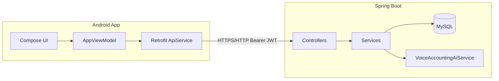

# 千万亿·记账（wyjqwy）

个人记账 Android 客户端 + Spring Boot 后端，支持手动记账、模板、统计图表、定投视图、对话式 AI 记账、账单 CSV 导入导出等能力。

## 项目结构

```
wyjqwy/
├── app/                    # Android 工程（Jetpack Compose）
│   ├── app/                # 主模块 com.wyjqwy.app
│   └── settings.gradle.kts
├── server/                 # 后端服务（Spring Boot 3 + MyBatis-Plus）
│   ├── src/main/java/      # 业务代码
│   ├── src/main/resources/
│   │   ├── application.yml
│   │   └── db/migration/   # Flyway 数据库迁移
│   └── push.sh             # 打包后上传 JAR 到服务器的脚本
└── openapi.yaml            # API 说明（部分接口与实现略有差异，以代码为准）
```

## 技术栈

| 层级 | 技术 |
|------|------|
| 客户端 | Kotlin、Jetpack Compose、Material3、Retrofit、OkHttp、DataStore |
| 后端 | Java 17、Spring Boot 3.3、Spring Security、JWT、MyBatis-Plus |
| 数据库 | MySQL 8 + Flyway 迁移 |
| AI | 智谱 GLM（默认）/ Google Gemini（可切换），用于「对话记账」文本解析 |

## 功能概览

### 底部 Tab

| Tab | 说明 |
|-----|------|
| 明细 | 按月浏览流水、日汇总、快捷模板（最多 15 个）、上下滑切换月份 |
| 图表 | 周/月/年维度支出收入统计、排行榜、趋势图 |
| 记账（中间） | 点击：分类+数字键盘记账；长按上滑：对话记账（文本输入） |
| 定投 | 投资理财类支出汇总与备注分组明细 |
| 我的 | 登录/退出、导入导出、个性装扮、账号设置 |

### 其他能力

- **登录 / 注册**：手机号作账号（11 位），JWT 鉴权，Token 自动刷新
- **分类管理**：系统分类 + 用户自建；删除时可迁移关联账单
- **全局搜索**：按关键词检索全量历史账单（服务端分页拉取）
- **日历视图**：按日查看流水
- **分类汇总**：多维度排序，支持按图表时间范围拉取明细
- **对话记账**：用户输入自然语言，后端 AI 解析为一条或多条账单并入库
- **导入 / 导出**：CSV（UTF-8 BOM），导出可分享；导入时未知分类归入「其他支出/其他收入」
- **主题**：多套主题色与纹理；跟随系统浅色/深色模式（`AppSemanticColors`）
- **主界面**：1 秒内连续返回两次退出应用

## 架构示意



## 环境要求

- **JDK 17+**
- **Maven 3.8+**（后端）
- **MySQL 8**（库名示例：`wyjqwy`）
- **Android Studio**（推荐最新稳定版）+ **Android SDK 34**
- （可选）智谱 / Google AI API Key（对话记账）

## 快速开始

### 1. 数据库

创建数据库（字符集建议 `utf8mb4`）：

```sql
CREATE DATABASE wyjqwy DEFAULT CHARACTER SET utf8mb4 COLLATE utf8mb4_unicode_ci;
```

修改 `server/src/main/resources/application.yml` 中的数据源账号密码。  
首次启动时 **Flyway** 会自动执行 `server/src/main/resources/db/migration/` 下的脚本（含系统分类种子数据）。

### 2. 启动后端

```bash
cd server
mvn clean package -DskipTests
java -jar target/wyjqwy-0.0.1.jar
```

默认端口：**8089**（见 `application.yml` 中 `server.port`）。

### 3. 运行 Android 客户端

```bash
cd app
./gradlew :app:installDebug
```

真机调试时需让手机能访问后端地址。在 `app/gradle.properties`（或命令行）配置：

```properties
SERVER_BASE_URL=http://你的电脑局域网IP:8089/
```

或在构建时：

```bash
./gradlew :app:installDebug -PSERVER_BASE_URL=http://192.168.0.105:8089/
```

未配置时默认使用 `app/app/build.gradle.kts` 中的 `SERVER_BASE_URL` 默认值。

## 配置说明

### 后端 `application.yml`

| 配置项 | 说明 |
|--------|------|
| `spring.datasource.*` | MySQL 连接 |
| `server.port` | 服务端口 |
| `app.jwt.secret` | JWT 签名密钥（生产环境务必更换，≥32 字节） |
| `app.ai.provider` | `zhipu`（默认）或 `google` |
| `app.ai.zhipu.*` | 智谱 API Key、模型名等 |
| `app.ai.google.*` | Gemini API Key、模型名等 |

切换 AI 提供商示例：

```yaml
app:
  ai:
    provider: google   # 或 zhipu
```

修改后重启后端即可。对话记账接口超时较长，客户端对 `/api/transactions/voice` 单独设置了 **180 秒** 超时。

> **安全提示**：请勿将真实 API Key、数据库密码提交到 Git。建议使用环境变量或本地未跟踪的配置文件覆盖 `application.yml`。

### 客户端

- **接口根地址**：`BuildConfig.SERVER_BASE_URL`
- **会话**：`SessionStore`（access / refresh token）
- **主题偏好**：`PreferencesStore`（主题模式等）

## 主要 API（实现侧）

前缀均为 `/api`，除登录注册外需在 Header 携带 `Authorization: Bearer <accessToken>`。

| 模块 | 路径 | 说明 |
|------|------|------|
| 认证 | `POST /auth/register` `login` `refresh` | 注册、登录、刷新 Token |
| 分类 | `GET/POST/PUT/DELETE /categories` | 分类 CRUD；`migrate-and-delete` 迁移后删除 |
| 账单 | `GET/POST/PUT/DELETE /transactions` | 分页查询、增删改 |
| 对话记账 | `POST /transactions/voice` | 文本解析并批量创建账单 |
| 模板 | `GET/POST/PUT/DELETE /templates` | 首页快捷模板 |
| 统计 | `GET /stats/summary` `trend` `by-category` | 汇总、趋势、分类排行 |

统一响应结构：`{ "code": 0, "message": "ok", "data": ... }`（业务失败时 `code` 非 0 或 HTTP 4xx）。

## 账单 CSV 格式（导入 / 导出）

- 编码：**UTF-8**，导出带 **BOM**，便于 Excel 打开
- 表头：`类型,金额,分类,备注,发生时间`
- **类型**：`支出` / `收入`（或 `1` / `2`）
- **时间**：如 `2026-04-29T12:30:00`、`2026-04-29 12:30:00`、`2026-04-29`
- 导入时若分类名在账号中不存在，自动归入 **其他支出** 或 **其他收入**
- 解析失败会提示具体行，例如：`第 18 行数据金额格式不正确`

实现位置：客户端 `app/.../data/bill/BillCsv.kt`，逻辑在 `AppViewModel.importBillCsvUtf8` / `fetchTransactionsForExport`。

## 客户端代码导航

| 路径 | 职责 |
|------|------|
| `ui/main/MainShell.kt` | 主导航、子页面路由、对话记账浮层 |
| `ui/AppViewModel.kt` | 全局状态、接口调用、缓存刷新 |
| `ui/detail/DetailScreen.kt` | 明细首页 |
| `ui/stats/StatsDashboardScreen.kt` | 图表统计 |
| `ui/category/CategoryPickerScreen.kt` | 记账键盘与分类选择 |
| `ui/main/MineImportExportScreen.kt` | 导入导出 |
| `ui/theme/BookkeepingTheme.kt` | 主题与深色模式 |
| `data/ApiService.kt` | Retrofit 接口定义 |

## 后端代码导航

| 路径 | 职责 |
|------|------|
| `controller/*Controller.java` | REST 入口 |
| `service/TransactionService.java` | 账单与对话记账 |
| `service/AuthService.java` | 登录注册 |
| `ai/VoiceAccountingAiService.java` | 大模型解析记账文本 |
| `security/SecurityConfig.java` | 鉴权与白名单 |

## 部署（参考）

`server/push.sh` 将本地 `target/wyjqwy-0.0.1.jar` 上传到服务器并执行远程 `start.sh restart`。部署前请自行修改脚本中的 `SERVER_USER`、`SERVER_IP`、`REMOTE_PATH`。

## 常见问题

1. **客户端连不上后端**  
   检查 `SERVER_BASE_URL`、防火墙、后端是否监听 `0.0.0.0`，真机不要用 `localhost`。

2. **登录提示手机号或密码错误 / 手机号已被注册**  
   后端 `BizException` 消息会在客户端映射为中文（见 `AppViewModel.mapAuthMessage`）。

3. **对话记账较慢**  
   属 AI 接口正常现象；客户端已延长该接口超时时间。

4. **导入后首页数据未更新**  
   导入成功后会触发 `refreshCachesAfterBulkImport()` 静默刷新；可切换 Tab 或下拉触发刷新。

## 许可证

未在仓库中声明开源协议；使用前请与项目维护者确认。
